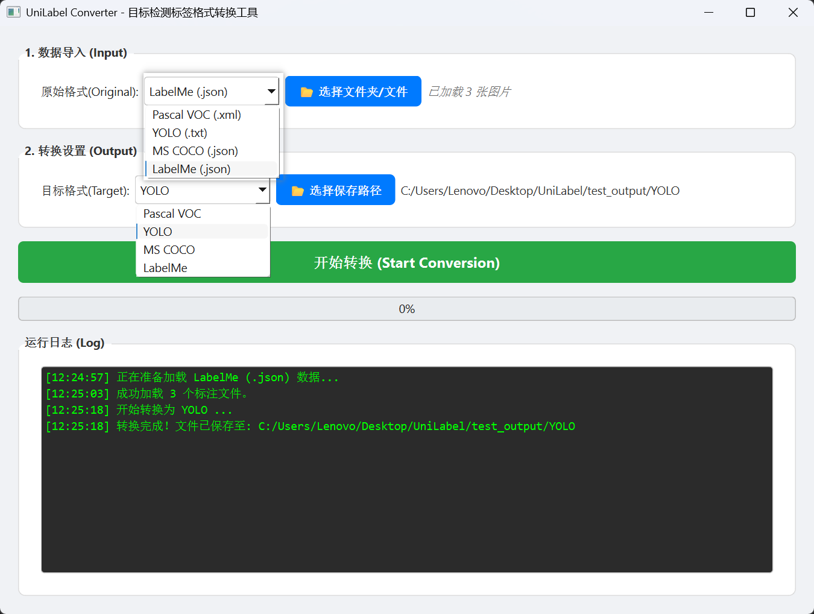

# UniLabel - Universal Object Detection Converter
# 通用目标检测标签格式转换工具

---

[](https://www.python.org/)
[](https://doc.qt.io/qtforpython/)
[](LICENSE)

**UniLabel** is a powerful and user-friendly GUI tool designed to convert object detection dataset annotations between various formats. Built with **PySide6**, it employs an Intermediate Representation (IR) architecture to ensure accurate and robust conversions.

**UniLabel** 是一个基于 **PySide6** 开发的通用目标检测数据集格式转换工具。它采用中间表示（IR）架构，能够实现主流标注格式之间的相互转换，支持批量处理，操作简单高效。



---

## 🔄 Supported Matrix / 支持矩阵

| Format                | Import (Read) | Export (Write) | Notes / 备注                                       |
| :-------------------- | :-----------: | :------------: | :------------------------------------------------- |
| **Pascal VOC (.xml)** |       ✅       |       ✅        | Standard XML format / 标准 XML                     |
| **YOLO (.txt)**       |       ✅       |       ✅        | Requires Images & `classes.txt` / 需图片和类别文件 |
| **MS COCO (.json)**   |       ✅       |       ✅        | Supports Batch Processing / 支持批量               |
| **LabelMe (.json)**   |       ✅       |       ✅        | Auto-detects images / 自动寻找图片                 |

---

## 🛠️ Installation / 安装指南

1.  **Clone the repository / 克隆仓库**
    
    ```bash
    git clone https://github.com/LCYvision/UniLabel.git
    cd UniLabel
    ```

2.  **Install dependencies / 安装依赖**
    ```bash
    pip install -r requirements.txt
    ```

3.  **Run the application / 运行软件**
    ```bash
    python main.py
    ```

---

## 📖 Usage / 使用说明

### 1. Import Data / 导入数据
*   Select the source format from the dropdown menu / 从下拉菜单中选择源格式。
*   Click **"Select Folder/File"** to load your dataset / 点击 **"选择文件夹/文件"** 来加载您的数据集

### 2. Export Settings / 导出设置
*   Select the target format (VOC, YOLO, COCO, or LabelMe) / 选择目标格式（VOC、YOLO、COCO 或 LabelMe）
*   Click **"Select Output Path"** to choose where to save the converted files / 点击 **"选择保存路径"** 来选择保存转换后文件的位置。

### 3. Start Conversion / 开始转换
*   Click **"Start Conversion"** / 点击**“开始转换”**
*   Wait for the progress bar to complete / 等待进度条完成

---

### ⚠️ NOTE  /  注意

#### 			The author only conducted a small amount of testing. You can test using a few samples in the test_import directory of the project.

#### 			作者只进行了少量的测试，你可以使用项目中test_import目录中的少量样本进行测试。

---

## 📂 Project Structure / 项目结构

```text
UniLabel/
├── main.py      	    # Entry point & GUI logic (程序入口 & 界面逻辑)
├── converters.py       # Importers & Exporters logic (核心转换算法)
├── ir_label.py         # Intermediate Representation Data Models (中间格式定义)
├── requirements.txt    # Python dependencies (依赖库)
├── test_import/        # Sample data for testing (测试样本)
└── README.md           # Documentation
```